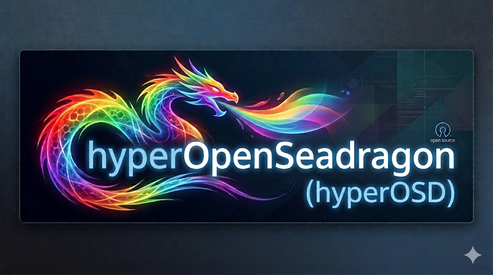
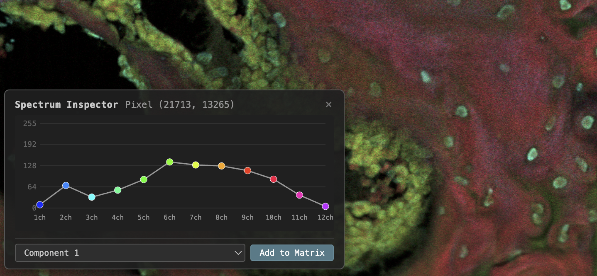

# hyperOpenSeadragon — Multi-Channel Fluorescence & Hyperspectral Image Viewer



hyperOpenSeadragon is a browser-based viewer for multi-channel fluorescence and hyperspectral microscopy images. It lets you blend up to 16 channels in real time, assign custom colors to each channel, and adjust gain — all from a single web page with no software to install.

## What It Does

- **Real-time channel blending** — Toggle channels on/off, pick a color for each, and adjust gain to highlight structures of interest. Changes appear instantly.
- **Z-stack navigation** — Switch between focal planes using a slider.
- **H&E and Masson Trichrome rendering** — Apply virtual histology stains as post-processing on top of your fluorescence data [1].
- **Tone mapping** — Choose between a knee-curve (preserves intensity ratios) or Reinhard (smooth compression for publication figures).
- **Save snapshots** — Export the current view as a PNG with an optional scale bar.
- **Pan, zoom, and rotate** — Explore your full-resolution image at any magnification, just like a digital slide scanner.
- **Linear spectral unmixing** — Load a spectral unmixing matrix to decompose overlapping fluorescence spectra into pure component channels. The matrix editor is built into the viewer.
- **Spectrum Inspector** — Inspect the spectrum of a pixel by right-clicking the image. Then click "Add to Matrix" to add the spectrum to the unmixing matrix.



## New in v3.0

- **PICASSO unmixing** — Apply iterative non-negative unmixing [2]. To generate a PICASSO unmixing matrix, see the [original author's repo](https://github.com/biomicrodev/picasso).

## How It Works

hyperOpenSeadragon runs entirely in your web browser. It uses [OpenSeadragon](https://openseadragon.github.io/) for tiled image display and a custom WebGL renderer for GPU-accelerated channel blending. Your images are pre-processed into tiled pyramids (Deep Zoom Image format), so even very large whole-slide images load smoothly.

**Demo link:** [https://imstore.circ.rochester.edu/hyperOSD/zstackHyper.html](https://imstore.circ.rochester.edu/hyperOSD/zstackHyper.html) - 12ch hyperspectral image of a mouse tendon from the hyperPICASSO unmixing paper [3].
The image was acquired using our custom high-speed silicon photomultiplier array [4].

## Getting Started

### 1. Set up the environment

```bash
# Using conda (recommended):
conda env create -f environment.yaml
conda activate hyperOSD

# Or with pip:
pip install flask "pyvips[binary]" pyyaml
```

### 2. Generate tiles with the web app

A **tile generator web app** is included — no command line experience needed:

```bash
python dzi_app.py
```

Open the URL shown in your terminal (typically `http://127.0.0.1:5000`). The app has two modes:

**Generate mode** — Convert your raw images into viewer-ready tiles:

1. Organize your images into folders by z-level:
   ```
   my_dataset/
   ├── 0.0um/
   │   ├── ch01.tif
   │   ├── ch02.tif
   │   └── ...
   └── 4.0um/          ← optional additional z-levels
       └── ...
   ```
   You can also use multi-page TIFF stacks (one file per z-level, each page = one channel).

2. Paste the folder path into the app and click **Scan**
3. Edit z-level names if needed
4. Click **Generate** — the app creates tiled pyramids and a ready-to-open viewer HTML in your dataset folder

The app auto-detects whether your images are grayscale (channel packing), RGB/RGBA (pre-composed), or multi-page TIFF stacks. Output tiles are always RGBA/PNG for maximum quality.

**Open Viewer mode** — View existing datasets without generating anything. Paste a folder path containing a viewer HTML and DZI tiles, and click **Load**. Useful for sharing datasets with collaborators who don't have a local HTTP server set up.

### 3. Alternative: command-line tool

For scripting or batch workflows, a command-line tool is also available:

```bash
# Single-channel grayscale TIFFs (up to 16 channels):
python generate_dzi.py --channels ch0.tif ch1.tif ch2.tif ch3.tif -o output_dir

# Pre-composed RGB images:
python generate_dzi.py --rgb image1.tif image2.tif -o output_dir

# Multi-z-level dataset via YAML config:
python generate_dzi.py --config example_config.yaml
```

See the `example_config.yaml` file for full configuration options including RGBA vs RGB packing modes.

### 4. Configure the viewer (manual setup only)

If you used the web app, a viewer HTML is generated automatically. For manual setup, open `zstackHyper.html` and update the **DATASET CONFIGURATION** block:

```javascript
var umPerPixel = 0.258;          // your pixel size in micrometers
var zLevelCount = 1;             // number of z-planes
var zLevelValues = [0];          // z-level labels (micrometers)
var channelsPerImage = 4;        // 4 for RGBA tiles, 3 for RGB tiles
var imageSources = [
    "path/to/your/data/0.0um/1/stitch.xml",
    "path/to/your/data/0.0um/2/stitch.xml",
    // ...
];
```

### 5. Open in a browser

Open the viewer HTML in Chrome, Firefox, or Edge. No server required — it runs from your local file system.

## Viewer Controls

| Control | What it does |
|---------|-------------|
| Channel checkboxes | Show/hide individual channels |
| H (hue) spinner | Set the display color for a channel |
| G (gain) spinner | Adjust brightness of a channel |
| Unmixing matrix | Load or edit a spectral unmixing matrix for linear unmixing |
| H&E / Trichrome checkbox | Apply virtual histology staining |
| Reinhard checkbox | Switch to smooth tone mapping for figures |
| Rotation slider | Rotate the image |
| z level slider | Switch between focal planes |
| Save Current View | Download a PNG snapshot (with optional scale bar) |

## Linear Spectral Unmixing

hyperOpenSeadragon includes a built-in linear unmixing pipeline for hyperspectral datasets. To use it:

1. Prepare a spectral unmixing matrix as a plain-text file (whitespace-separated, one row per output channel).
2. Either:
   - **Auto-load** — set `matrixFileName` in the DATASET CONFIGURATION block to the path of your matrix file (relative to the viewer HTML). The viewer loads it on startup; if the file is not found, the matrix table is shown empty (zero-filled).
   - **Manual** — toggle the **Linear Unmixing** checkbox in the Post-Processing section, then click **Load** to pick a `.txt` file.
3. Edit cells directly in the matrix table if you want to tweak values. The button row gives you:
   - **Apply** — engagement toggle. First click commits your edits and engages the filter (label flips to **ENGAGED ✓** and the panel header shows a green **ENGAGED** badge); next click disengages. The panel stays open after disengage so you can keep iterating.
   - **Zero** — blank the matrix without disengaging the filter (useful while iterating).
   - **Reload** — discard edits and re-fetch the configured file.
   - **Save** — write the current matrix back to disk as `.txt` (uses the File System Access API in supported browsers, with a download fallback elsewhere).

   To fully disengage AND close the panel, uncheck the **Linear Unmixing** toggle in the Post-Processing section. While engaged, the **Zero**, **Reload**, and output-count dropdown are locked to prevent matrix/GPU state mismatches.

## PICASSO Unmixing (v3.0 beta)

PICASSO applies iterative non-negative unmixing on top of linear unmixing (or as a standalone stage). It's currently **beta** — it works well on synthetic and calibrated datasets but quality on arbitrary real-world data varies. Treat as a preview.

To generate a PICASSO matrix from your data, see the [original author's repo](https://github.com/biomicrodev/picasso) and the hyperPICASSO adaptation [3].

**Matrix file format** (plain text, `.txt`):

```
# picasso v1 N=4 K=5
0.97  0.01  0.01  0.01
0.01  0.97  0.01  0.01
0.01  0.01  0.97  0.01
0.01  0.01  0.01  0.97

<repeat for K total N×N blocks, separated by blank lines>
```

- `N` — matrix size (2–8). When chaining with Linear Unmixing, `N` must equal Linear's output count `M`.
- `K` — number of iteration blocks (1–10).
- Optional header keys: `gamma=…`, `source=…`, `kind=…`.

**Load a matrix two ways:**

1. **Auto-load on startup** — set `picassoMatrixFileName` in the DATASET CONFIGURATION block (path relative to the viewer HTML). Optionally set `defaultPicasso = true` to auto-Apply on page load.
2. **Manual** — toggle the **PICASSO** checkbox in the Post-Processing section to open the panel, click **Load**, pick your `.txt` file, then click **Apply**.

The iteration count is adjustable at runtime via the **K** spinner in the panel dim-bar (range 1–10; capped at the loaded file's K). The Apply button is an engagement toggle (same UX as Linear — label flips to **ENGAGED ✓**, a green **ENGAGED** badge appears in the panel header, click again to disengage). Reload is locked while engaged.

**Chaining with Linear (Mode 3):** enable Linear first, set its output count `M` to match the PICASSO matrix's `N`, click Linear → Apply, then PICASSO → Apply. The Linear panel locks while PICASSO is engaged so the chain dimensions stay consistent.

## Requirements

- A modern web browser with WebGL support (Chrome, Firefox, Edge, Safari)
- Python 3 with `pyvips` and `pyyaml` for tile generation
- `flask` for the tile generator web app (optional if using CLI only)
- On macOS/Linux without conda: `brew install vips` or `apt install libvips-dev`

## References

- [1] Giacomelli MG, Husvogt L, Vardeh H, Faulkner-Jones BE, Hornegger J, Connolly JL, Fujimoto JG. Virtual Hematoxylin and Eosin Transillumination Microscopy Using Epi-Fluorescence Imaging. PLoS One. 2016 Aug 8;11(8):e0159337. doi: 10.1371/journal.pone.0159337. PMID: 27500636; PMCID: PMC4976978.
- [2] Seo J, Sim Y, Kim J, Kim H, Cho I, Nam H, Yoon YG, Chang JB. PICASSO allows ultra-multiplexed fluorescence imaging of spatially overlapping proteins without reference spectra measurements. Nat Commun. 2022 May 5;13(1):2475. doi: 10.1038/s41467-022-30168-z. PMID: 35513404; PMCID: PMC9072354.
- [3] Huang CZ, Ching-Roa VD, Giacomelli MG. hyperPICASSO: adapting the mutual-information-based unmixing technique PICASSO to hyperspectral datasets. Opt Lett. 2025 Jul 1;50(13):4386-4389. doi: 10.1364/OL.564010. PMID: 40591326; PMCID: PMC12497483.
- [4] Huang CZ, Ching-Roa VD, Heckman CM, Ibrahim SF, Giacomelli MG. High-throughput hyperspectral fluorescence imaging using a high-speed silicon photomultiplier array. Biomed Opt Express. 2025 Sep 5;16(10):3949-3957. doi: 10.1364/BOE.573312. PMID: 41112783; PMCID: PMC12532339.
