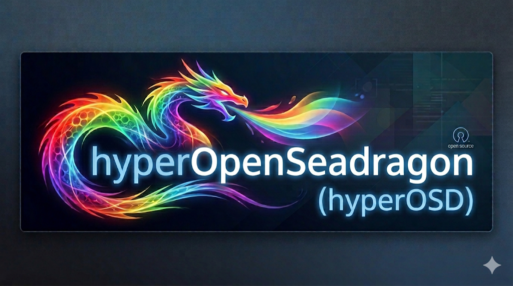
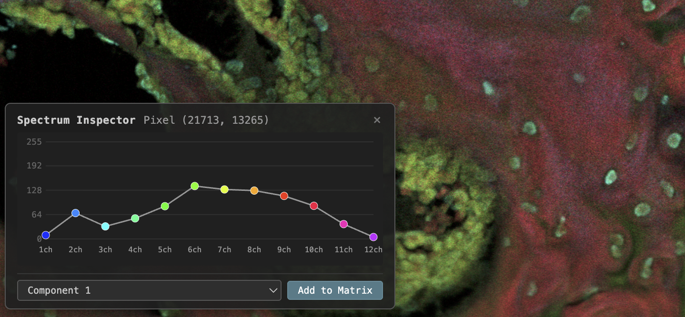
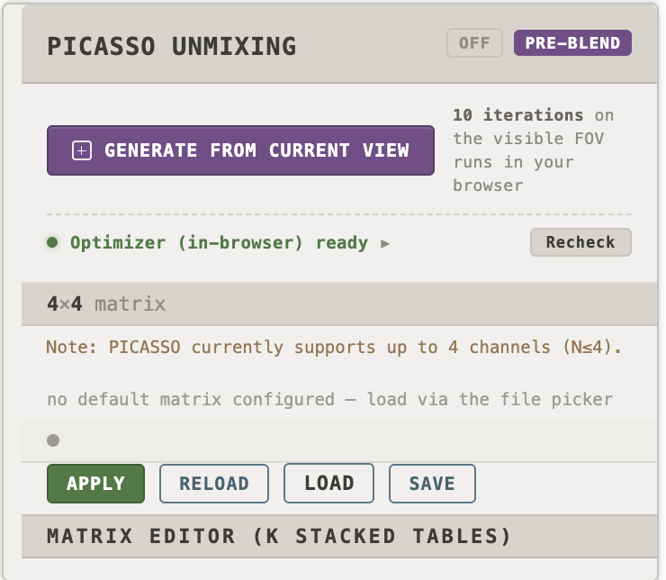

# hyperOpenSeadragon — Multi-Channel Fluorescence & Hyperspectral Image Viewer



hyperOpenSeadragon is a browser-based viewer for multi-channel fluorescence and hyperspectral microscopy images. It lets you blend up to 16 channels in real time, assign custom colors to each channel, and adjust gain — all from a single web page with no software to install.

## What It Does

- **Real-time channel blending** — Toggle channels on/off, pick a color for each, and adjust gain to highlight structures of interest. Changes appear instantly.
- **Z-stack navigation** — Switch between focal planes using a slider.
- **H&E and Masson Trichrome rendering** — Apply virtual histology stains as post-processing on top of your fluorescence data [1].
- **Tone mapping** — Choose between a knee-curve (preserves intensity ratios) or Reinhard (smooth compression for publication figures).
- **Save snapshots** — Export the current view as a PNG with an optional scale bar.
- **Pan, zoom, and rotate** — Explore your full-resolution image at any magnification, just like a digital slide scanner.
- **Linear spectral unmixing** — Load a spectral unmixing matrix to decompose overlapping fluorescence spectra into pure component channels. The matrix editor is built into the viewer.
- **Spectrum Inspector** — Inspect the spectrum of a pixel by right-clicking the image. Then click "Add to Matrix" to add the spectrum to the unmixing matrix.
- **PICASSO unmixing** — Apply iterative non-negative unmixing [2].
- **Multi-class annotation** — Draw pixel-accurate masks over the image with a polygon or brush tool, and export them as label images for training or downstream analysis.



## New in v3.4.3

- **One output button: Save Mask** — the separate **Export Mask** button is gone. **Save Mask** writes one binary PNG per class that has pixels (white = that class, black = everything else) plus the `classes.json` that maps them back, and the status line now says how many files will download (`Saving 3 files…`). The **Downscale** setting (Full / 4096 / 2048, default 4096) now sets the resolution of those PNGs, and **Load Mask** reopens a set saved at any of them — a downscaled set is scaled back up to the mask when it loads. At the viewer's default mask resolution Full and 4096 write the same files; 2048 halves them. A mask with no pixels in any class is refused instead of downloading a lone `classes.json`. See [Annotation](#annotation) below.

## New in v3.4.2

- **Annotation classes may overlap** — two classes can now cover the same pixels. Where they overlap the colours add (red over green reads as yellow) at the *same* opacity as everywhere else, so an overlap no longer shows up as a darker, muddier band. Each class keeps its own mask, so erasing, undo and Save all act on one class at a time. See [Annotation](#annotation) below.
- **Save Session now writes one PNG per class** — a session is now **one mask PNG for each class that has pixels, plus a `classes.json`**, instead of a single combined label PNG. **To reload a session, select all of those files together in the Load dialog** — the `classes.json` is what maps each PNG back to its class, so it must be part of the selection. Sessions saved by earlier versions still load exactly as before: pick the single PNG on its own.
- **The eraser now clears only the active class** — previously one eraser stroke removed every class's pixels under the brush. To clear several classes, switch class and erase again.
- **Editing polygons got easier** — click a vertex to select it (it highlights), then press **Backspace** or **Delete** to remove it. A small dead zone means clicking a handle no longer nudges the shape by a pixel. Clicking inside a shape behaves predictably whether you work in one class or nest several: the boundary edits the selected shape, the interior draws in the active class.

## New in v3.4.1

- **Eraser-proof polygons and edge handles** — the eraser now only removes brush paint *outside* your closed polygons, so a finished region cannot be nibbled away by a stray stroke; the protection spans every class, and an unclosed draft protects nothing. Reshaping gained an edge grab: **drag anywhere on a polygon's edge** to insert a new handle at that point, instead of having to place every vertex when you first draw the shape. Deleting a polygon still erases its pixels, and a single **Ctrl+Z** still restores both. See [Annotation](#annotation) below.
- **Hardening and a long-session fix** — the tile-generation web app now refuses to read or write outside the dataset folder, including through symlinks, and escapes dataset-supplied text before it reaches the generated viewer. Stepping through z-levels quickly no longer leaks tile layers, which previously accumulated for the life of the page.

## New in v3.4

- **Polygon annotation** — The annotator is now a two-tool package: **Polygon** for click-to-place or freehand regions, **Brush** for free-form painting. Closed polygons stay editable — click one to select it, drag its vertex handles to reshape it, press **Backspace** to delete it — and a reshape rewrites only the pixels that actually changed. The separate Eraser radio is gone: **hold Alt** to erase while brushing. Bare keys **P**/**B** switch tool and **1**–**9** switch class, and a saved session now carries its polygons alongside the label mask, so a reloaded session is still editable. See [Annotation](#annotation) below.

## New in v3.3

- **OSDAnnotator — multi-class paintbrush annotation** — Paint free-form pixel masks directly on the image. Supports up to 16 classes, each with its own color, stored as a single indexed mask. The brush is screen-space (its on-screen size stays constant as you zoom); **Shift + scroll wheel** resizes it without affecting the normal zoom-on-scroll behavior. Includes stroke-level **Undo/Redo** (Ctrl+Z / Ctrl+Y), one-click **Export Mask** (binary PNG of the active class), and **Save/Load Session** (indexed label PNG + a `.classes.json` sidecar, reloadable later). See [Annotation](#annotation) below.

## New in v3.2.1

- **GPU guided-filter denoise** — Edge-preserving, display-only denoising applied as a post-processing pass between HyperBlend and Beer's law. Off by default; enable via the **Denoise (Guided)** toggle in Post-Processing and tune with the 0–100 **Strength** slider. Original tile data is never modified. The toggle is hidden automatically when the GPU does not support float framebuffers.

## New in v3.2

- **PICASSO unmixing Matrix Generation** — Generate a PICASSO unmixing matrix using the web interface. The matrix is generated using the built-in optimizer.


## How It Works

hyperOpenSeadragon runs entirely in your web browser. It uses [OpenSeadragon](https://openseadragon.github.io/) for tiled image display and a custom WebGL renderer for GPU-accelerated channel blending. Your images are pre-processed into tiled pyramids (Deep Zoom Image format), so even very large whole-slide images load smoothly.

**Demo link:** [https://imstore.circ.rochester.edu/hyperOSD/zstackHyper.html](https://imstore.circ.rochester.edu/hyperOSD/zstackHyper.html) - 12ch hyperspectral image of a mouse tendon from the hyperPICASSO unmixing paper [3].
The image was acquired using our custom high-speed silicon photomultiplier array [4].

## Getting Started

### 1. Set up the environment

```bash
# Using conda (recommended):
conda env create -f environment.yaml
conda activate hyperOSD

# Or with pip:
pip install flask "pyvips[binary]" pyyaml
```

### 2. Generate tiles with the web app

A **tile generator web app** is included — no command line experience needed:

```bash
python dzi_app.py
```

Open the URL shown in your terminal (typically `http://127.0.0.1:5000`). The app has two modes:

**Generate mode** — Convert your raw images into viewer-ready tiles:

1. Organize your images into folders by z-level:
   ```
   my_dataset/
   ├── 0.0um/
   │   ├── ch01.tif
   │   ├── ch02.tif
   │   └── ...
   └── 4.0um/          ← optional additional z-levels
       └── ...
   ```
   You can also use multi-page TIFF stacks (one file per z-level, each page = one channel).

2. Paste the folder path into the app and click **Scan**
3. Edit z-level names if needed
4. Click **Generate** — the app creates tiled pyramids and a ready-to-open viewer HTML in your dataset folder

The app auto-detects whether your images are grayscale (channel packing), RGB/RGBA (pre-composed), or multi-page TIFF stacks. Output tiles are always RGBA/PNG for maximum quality.

**Open Viewer mode** — View existing datasets without generating anything. Paste a folder path containing a viewer HTML and DZI tiles, and click **Load**. Useful for sharing datasets with collaborators who don't have a local HTTP server set up.

### 3. Alternative: command-line tool

For scripting or batch workflows, a command-line tool is also available:

```bash
# Single-channel grayscale TIFFs (up to 16 channels):
python generate_dzi.py --channels ch0.tif ch1.tif ch2.tif ch3.tif -o output_dir

# Pre-composed RGB images:
python generate_dzi.py --rgb image1.tif image2.tif -o output_dir

# Multi-z-level dataset via YAML config:
python generate_dzi.py --config example_config.yaml
```

See the `example_config.yaml` file for full configuration options including RGBA vs RGB packing modes.

### 4. Configure the viewer (manual setup only)

If you used the web app, a viewer HTML is generated automatically. For manual setup, open `zstackHyper.html` and update the **DATASET CONFIGURATION** block:

```javascript
var umPerPixel = 0.258;          // your pixel size in micrometers
var zLevelCount = 1;             // number of z-planes
var zLevelValues = [0];          // z-level labels (micrometers)
var channelsPerImage = 4;        // 4 for RGBA tiles, 3 for RGB tiles
var imageSources = [
    "path/to/your/data/0.0um/1/stitch.xml",
    "path/to/your/data/0.0um/2/stitch.xml",
    // ...
];
```

### 5. Open in a browser

Open the viewer HTML in Chrome, Firefox, or Edge. No server required — it runs from your local file system.

## Viewer Controls

| Control | What it does |
|---------|-------------|
| Channel checkboxes | Show/hide individual channels |
| H (hue) spinner | Set the display color for a channel |
| G (gain) spinner | Adjust brightness of a channel |
| Unmixing matrix | Load or edit a spectral unmixing matrix for linear unmixing |
| H&E / Trichrome checkbox | Apply virtual histology staining |
| Reinhard checkbox | Switch to smooth tone mapping for figures |
| Rotation slider | Rotate the image |
| z level slider | Switch between focal planes |
| Denoise (Guided) checkbox | Toggle edge-preserving GPU denoise (display-only; hidden if GPU lacks float-FBO support) |
| Strength slider | Adjust denoise strength 0–100 (higher = more smoothing) |
| Save Current View | Download a PNG snapshot (with optional scale bar) |
| Annotation panel | Draw multi-class pixel masks with the polygon or brush tool (see [Annotation](#annotation)) |

## Linear Spectral Unmixing

hyperOpenSeadragon includes a built-in linear unmixing pipeline for hyperspectral datasets. To use it:

1. Prepare a spectral unmixing matrix as a plain-text file (whitespace-separated, one row per output channel).
2. Either:
   - **Auto-load** — set `matrixFileName` in the DATASET CONFIGURATION block to the path of your matrix file (relative to the viewer HTML). The viewer loads it on startup; if the file is not found, the matrix table is shown empty (zero-filled).
   - **Manual** — toggle the **Linear Unmixing** checkbox in the Post-Processing section, then click **Load** to pick a `.txt` file.
3. Edit cells directly in the matrix table if you want to tweak values. The button row gives you:
   - **Apply** — engagement toggle. First click commits your edits and engages the filter (label flips to **ENGAGED ✓** and the panel header shows a green **ENGAGED** badge); next click disengages. The panel stays open after disengage so you can keep iterating.
   - **Zero** — blank the matrix without disengaging the filter (useful while iterating).
   - **Reload** — discard edits and re-fetch the configured file.
   - **Save** — write the current matrix back to disk as `.txt` (uses the File System Access API in supported browsers, with a download fallback elsewhere).

   To fully disengage AND close the panel, uncheck the **Linear Unmixing** toggle in the Post-Processing section. While engaged, the **Zero**, **Reload**, and output-count dropdown are locked to prevent matrix/GPU state mismatches.

## PICASSO Unmixing

PICASSO applies iterative non-negative unmixing on top of linear unmixing (or as a standalone stage). It's currently **beta** — it works well on synthetic and calibrated datasets but quality on arbitrary real-world data varies. Treat as a preview.

To generate a PICASSO matrix from your data, you can generate it directly in the web browser using the built-in optimizer (by clicking the **Generate from current view** button in the PICASSO panel). Alternatively, you can pre-generate it using the [original author's repo](https://github.com/biomicrodev/picasso) and the hyperPICASSO adaptation [3].

**Matrix file format** (plain text, `.txt`):

```
# picasso v1 N=4 K=5
0.97  0.01  0.01  0.01
0.01  0.97  0.01  0.01
0.01  0.01  0.97  0.01
0.01  0.01  0.01  0.97

<repeat for K total N×N blocks, separated by blank lines>
```

- `N` — matrix size (2–8). When chaining with Linear Unmixing, `N` must equal Linear's output count `M`.
- `K` — number of iteration blocks (1–10).
- Optional header keys: `gamma=…`, `source=…`, `kind=…`.

**Load a matrix two ways:**

1. **Auto-load on startup** — set `picassoMatrixFileName` in the DATASET CONFIGURATION block (path relative to the viewer HTML). Optionally set `defaultPicasso = true` to auto-Apply on page load.
2. **Manual** — toggle the **PICASSO** checkbox in the Post-Processing section to open the panel, click **Load**, pick your `.txt` file, then click **Apply**.

The iteration count is adjustable at runtime via the **K** spinner in the panel dim-bar (range 1–10; capped at the loaded file's K). The Apply button is an engagement toggle (same UX as Linear — label flips to **ENGAGED ✓**, a green **ENGAGED** badge appears in the panel header, click again to disengage). Reload is locked while engaged.

**Chaining with Linear (Mode 3):** enable Linear first, set its output count `M` to match the PICASSO matrix's `N`, click Linear → Apply, then PICASSO → Apply. The Linear panel locks while PICASSO is engaged so the chain dimensions stay consistent.

## Annotation

OSDAnnotator lets you draw multi-class pixel masks on top of the image — useful for marking regions of interest, generating training labels, or flagging artifacts. It's a self-contained plugin (`openseadragon/osd-annotator.js`) built only on the public OpenSeadragon API, with no effect on the blending/PICASSO/denoise pipeline. The deliverable is always the indexed label mask — one pixel, one class id; polygons are an editing affordance on top of that mask, not a second vector format.

1. Open the **Annotation** panel and check **Active (arm painting)** to arm the tool. While active, left-drag draws and right-drag pans the viewer (plain scroll still zooms). While disarmed the controls dim and every click pans and zooms the slide as usual.
2. Use **+ Add class** to create up to 16 classes; each row lets you recolor, rename, or delete a class, and a radio button picks which class is active (everything you draw takes the active class's id).
3. Pick a tool — **Polygon (P)** or **Brush (B)**:
   - **Polygon** — click to place vertices; **double-click** or **Enter** closes the ring and fills it with the active class; **Esc** cancels the draft. Click-drag instead draws freehand and closes on release.
   - **Brush** — left-drag paints with the active class, and **hold Alt** to erase for as long as the key is down. The eraser cannot remove pixels inside a closed polygon of any class — it only erases brush paint outside them, so a finished region cannot be nibbled away by a stray stroke. An unclosed draft protects nothing. Set the size with the slider (1–100 px) or **Shift + scroll wheel**; the footprint is screen-space, so it stays the same size on screen regardless of zoom level.
4. Closed polygons stay editable. Click inside one of your polygons in the active class to select it — its outline and vertex handles appear — then drag a handle to reshape it, or **drag on an edge** to insert a new handle at the point you grabbed. The mask is rewritten on release and only the pixels that actually changed are touched. With a polygon selected, clicking inside it again starts a new polygon nested within it, **Esc** deselects, and **Backspace** or **Delete** removes it (erasing that class's pixels inside it — a single **Undo** restores both).
5. Keyboard shortcuts are live while the annotator is armed, and never while you are typing in a text field:
   - **P** / **B** — switch to the Polygon / Brush tool.
   - **1**–**9** — select that class, by position in the class list.
   - **Alt** (hold) — temporarily erase; Brush tool only.
   - **Enter** / **Esc** — close the open polygon / cancel the draft or deselect.
   - **Backspace** / **Delete** — delete the selected polygon.
   - **Ctrl+Z** / **Ctrl+Y** — undo / redo (**Ctrl+Shift+Z** also redoes).
6. **Save Mask** downloads a timestamped set — one binary PNG per class that has pixels (white = that class, black = everywhere else) plus a `<name>.classes.json` that maps each PNG to its class and carries the class names/colors **and the polygons**. The status line tells you how many files will download; if no class has any pixels the save is refused. The **Downscale** setting (Full / 4096 / 2048, default 4096) sets the shorter side of the PNGs. **Load Mask** reopens a set — **select every PNG from that save and its `classes.json` together** in the file dialog — and restores the polygon handles, so you can carry on reshaping where you left off; a downscaled set is scaled back up to the mask as it loads. A single PNG on its own still loads as a legacy label mask (defaulting to auto-named classes), and sidecars written by v3.3 still load.
7. **Undo / Redo** (Ctrl+Z / Ctrl+Y) operate at stroke granularity, depth 20 — one polygon fill, one brush stroke, or one reshape per step. **Clear Mask** wipes all classes' pixels (not undoable).

## Requirements

- A modern web browser with WebGL support (Chrome, Firefox, Edge, Safari)
- Python 3 with `pyvips` and `pyyaml` for tile generation
- `flask` for the tile generator web app (optional if using CLI only)
- On macOS/Linux without conda: `brew install vips` or `apt install libvips-dev`

## References

- [1] Giacomelli MG, Husvogt L, Vardeh H, Faulkner-Jones BE, Hornegger J, Connolly JL, Fujimoto JG. Virtual Hematoxylin and Eosin Transillumination Microscopy Using Epi-Fluorescence Imaging. PLoS One. 2016 Aug 8;11(8):e0159337. doi: 10.1371/journal.pone.0159337. PMID: 27500636; PMCID: PMC4976978.
- [2] Seo J, Sim Y, Kim J, Kim H, Cho I, Nam H, Yoon YG, Chang JB. PICASSO allows ultra-multiplexed fluorescence imaging of spatially overlapping proteins without reference spectra measurements. Nat Commun. 2022 May 5;13(1):2475. doi: 10.1038/s41467-022-30168-z. PMID: 35513404; PMCID: PMC9072354.
- [3] Huang CZ, Ching-Roa VD, Giacomelli MG. hyperPICASSO: adapting the mutual-information-based unmixing technique PICASSO to hyperspectral datasets. Opt Lett. 2025 Jul 1;50(13):4386-4389. doi: 10.1364/OL.564010. PMID: 40591326; PMCID: PMC12497483.
- [4] Huang CZ, Ching-Roa VD, Heckman CM, Ibrahim SF, Giacomelli MG. High-throughput hyperspectral fluorescence imaging using a high-speed silicon photomultiplier array. Biomed Opt Express. 2025 Sep 5;16(10):3949-3957. doi: 10.1364/BOE.573312. PMID: 41112783; PMCID: PMC12532339.
